<!--
  EDIT-ME MAP
  - Replace the GIF:   drop any GIF at assets/gif/current.gif and push (the Action builds assets/gif/framed.svg)
  - Projects:          section 02. Each project is one block; 3 places hold its link (search for YOUR_)
  - Placeholders:      search this file for YOUR_
  - Pixel art:         assets/*.svg are plain and editable; regenerate with `node scripts/build-assets.mjs`
-->

<div align="center">

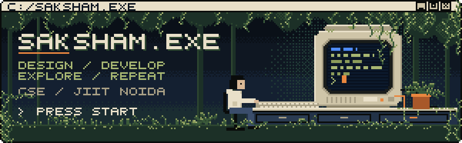

<br><br>


</div>

<br><br>

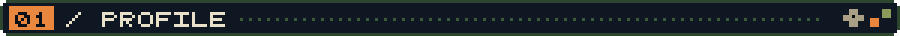

<br>

**Saksham Gupta** · CSE @ JIIT Noida · designer + developer

```text
> I design interfaces, then immediately start wondering how to implement them.
> Currently building things, breaking things, and occasionally fixing them.
> Open source enjoyer. Pixel art hobbyist. Professional overthinker.
```

<sub>Into: UI/UX · frontend · full-stack · open source · pixel art · experimental software</sub>

<div align="center">

<b>DESIGN</b> wireframes → interfaces → pixels &nbsp;&nbsp; ◆ &nbsp;&nbsp; <b>DEVELOP</b> components → APIs → systems

</div>

<br>

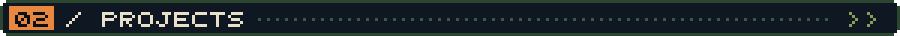

<br>

<p>
<a href="YOUR_TILES_REPO">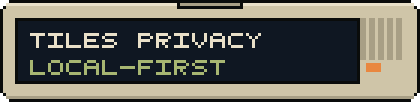</a>
<a href="YOUR_LAN_TRANSFER_REPO">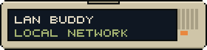</a>
<a href="YOUR_FOOD_DELIVERY_REPO">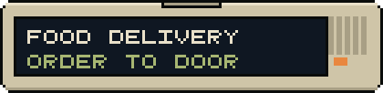</a>
<a href="YOUR_SAKSHAMOS_REPO">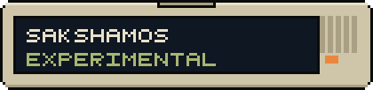</a>
</p>

**[Tiles Privacy](YOUR_TILES_REPO)** · privacy / local-first · [VIEW REPOSITORY →](YOUR_TILES_REPO)<br>
**[LAN Transfer Buddy](YOUR_LAN_TRANSFER_REPO)** · move files across your local network · [VIEW REPOSITORY →](YOUR_LAN_TRANSFER_REPO)<br>
**[Food Delivery System](YOUR_FOOD_DELIVERY_REPO)** · ordering + delivery, end to end · [VIEW REPOSITORY →](YOUR_FOOD_DELIVERY_REPO)<br>
**[SakshamOS](YOUR_SAKSHAMOS_REPO)** · experimental software, built for fun · [VIEW REPOSITORY →](YOUR_SAKSHAMOS_REPO)

<br>

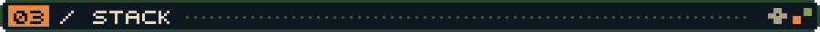

<br>

<sub>EQUIPPED</sub>

`LANGUAGES` &nbsp;`C++` &nbsp; 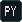&nbsp;`Python` &nbsp; &nbsp;`JavaScript` &nbsp; &nbsp;`HTML/CSS` &nbsp; &nbsp;`PHP`<br>
`WEB      ` 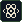&nbsp;`React` &nbsp; &nbsp;`Next.js` &nbsp; &nbsp;`Tailwind` &nbsp; &nbsp;`FastAPI` &nbsp; &nbsp;`Node.js` &nbsp; &nbsp;`MySQL`<br>
`TOOLS    ` &nbsp;`Git` &nbsp; &nbsp;`GitHub` &nbsp; &nbsp;`Photoshop` &nbsp; &nbsp;`Aseprite` &nbsp; &nbsp;`Figma`

<br>

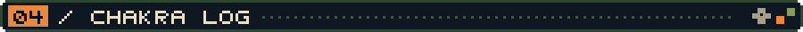

<br>

<p align="center">
<br>
<sub>Redrawn every 6 hours by a GitHub Action from the contribution calendar. The corner of the image says SAMPLE DATA until the first successful run.</sub>
</p>

<br>

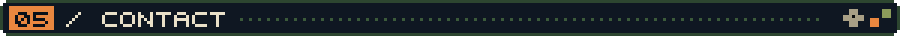

<br>

[LinkedIn](YOUR_LINKEDIN) · [Email](mailto:YOUR_EMAIL) · [Portfolio](YOUR_PORTFOLIO) · [OSDC](YOUR_OSDC_ORG)

```text
SYSTEM STATUS

DESIGN      [OK]
CODE        [OK]
COFFEE      [LOW]
SLEEP       [ERROR]

> thanks for visiting my RAM
> connection terminated
> ideas still running_
```
