<table>
<tr>
<td>01 <a href="https://github.com/Sakshamcozykun/GoogleClasroom-Bulk-downloader"><b>CLASSROOM-DL</b></a></td>
<td>02 <a href="https://github.com/Sakshamcozykun/-Beauty-Finder-AI-Powered-Product-Recommendation-Tool"><b>BEAUTY-FINDER</b></a></td>
<td>03 <a href="https://github.com/Sakshamcozykun/fakejobposting-"><b>FAKEJOBPOSTING</b></a></td>
</tr>
<tr>
<td>04 <a href="https://github.com/Sakshamcozykun/ShareSplit"><b>SHARESPLIT</b></a></td>
<td>05 <a href="https://github.com/Sakshamcozykun/tiles"><b>TILES</b></a></td>
<td>06 <a href="https://github.com/Cyberpunk-San/Kabadiwala"><b>KABADIWALA</b></a></td>
</tr>
</table>

<table>
<tr>
<td width="170" valign="top">
<b>&#9656; <a href="https://github.com/Sakshamcozykun?tab=repositories">PROJECTS</a></b>  
<a href="https://github.com/YOUR_OSDC_ORG">OSDC</a>  
<a href="https://YOUR_PORTFOLIO">DESIGN WORK</a>  
<a href="mailto:YOU@MAIL.COM">CONTACT</a>
</td>
<td></td>
</tr>
</table>

[**LINKEDIN**](https://linkedin.com/in/YOUR_HANDLE) &nbsp;/&nbsp; [**EMAIL**](mailto:YOU@MAIL.COM) &nbsp;/&nbsp; [**PORTFOLIO**](https://YOUR_PORTFOLIO)

