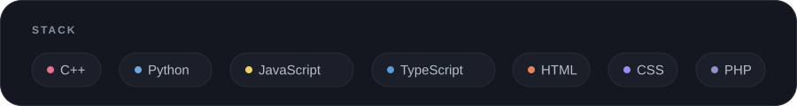
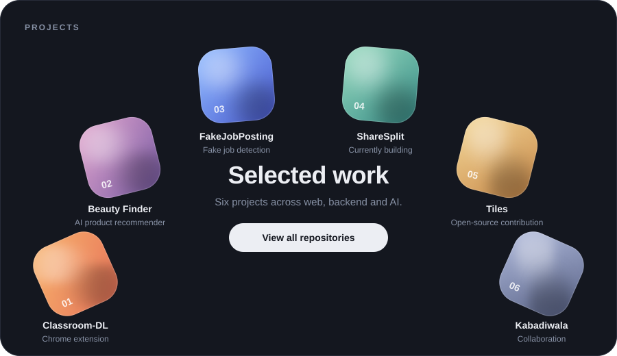

<a href="https://github.com/Sakshamcozykun/GoogleClasroom-Bulk-downloader">Classroom-DL</a> &nbsp;·&nbsp;
<a href="https://github.com/Sakshamcozykun/-Beauty-Finder-AI-Powered-Product-Recommendation-Tool">Beauty Finder</a> &nbsp;·&nbsp;
<a href="https://github.com/Sakshamcozykun/fakejobposting-">FakeJobPosting</a> &nbsp;·&nbsp;
<a href="https://github.com/Sakshamcozykun/ShareSplit">ShareSplit</a> &nbsp;·&nbsp;
<a href="https://github.com/Sakshamcozykun/tiles">Tiles</a> &nbsp;·&nbsp;
<a href="https://github.com/Cyberpunk-San/Kabadiwala">Kabadiwala</a>

 

<a href="https://github.com/Sakshamcozykun?tab=repositories">Projects</a> &nbsp;·&nbsp;
<a href="https://github.com/YOUR_OSDC_ORG">OSDC</a> &nbsp;·&nbsp;
<a href="https://YOUR_PORTFOLIO">Design work</a> &nbsp;·&nbsp;
<a href="https://linkedin.com/in/YOUR_HANDLE">LinkedIn</a> &nbsp;·&nbsp;
<a href="mailto:YOU@MAIL.COM">Email</a>

