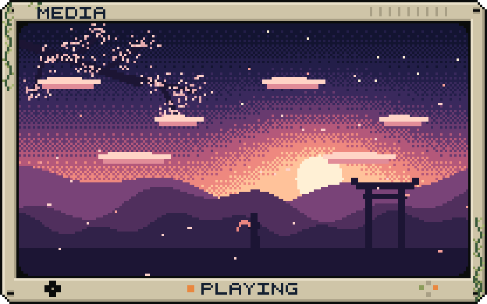
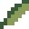
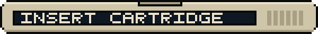

<!--
  EDIT-ME MAP
  - Replace the GIF:      drop any GIF at assets/gif/current.gif (the Action builds framed.gif)
  - Projects:             edit the 4 table cells in section 02
  - Placeholders:         search this file for YOUR_
  - Everything pixel:     assets/*.svg (hand-editable) ; regenerate with `node scripts/build-assets.mjs`
-->

<div align="center">




</div>

<br>


**Saksham Gupta** · CSE @ JIIT Noida · designer + developer 

I design interfaces, then immediately start wondering how to implement them.
Currently building things, breaking things, and occasionally fixing them.
Open source enjoyer. Pixel art hobbyist. Professional overthinker.

Into: UI/UX · frontend · full-stack · open source · pixel art · experimental software

<table>
<tr>
<th width="50%" align="center">DESIGN</th>
<th width="50%" align="center">DEVELOP</th>
</tr>
<tr>
<td align="center">wireframes → interfaces → pixels<br><sub>Figma · Photoshop · Aseprite</sub></td>
<td align="center">components → APIs → systems<br><sub>React · Next.js · FastAPI · Node.js</sub></td>
</tr>
</table>

<br>


<table>
<tr>
<td width="50%" valign="top">
<br>
<b><a href="YOUR_TILES_REPO">Tiles Privacy</a></b><br>
privacy / local-first<br>
<sub><a href="YOUR_TILES_REPO">VIEW REPOSITORY →</a></sub>
</td>
<td width="50%" valign="top">
<br>
<b><a href="YOUR_LAN_TRANSFER_REPO">LAN Transfer Buddy</a></b><br>
move files across your local network<br>
<sub><a href="YOUR_LAN_TRANSFER_REPO">VIEW REPOSITORY →</a></sub>
</td>
</tr>
<tr>
<td width="50%" valign="top">
<br>
<b><a href="YOUR_FOOD_DELIVERY_REPO">Food Delivery System</a></b><br>
ordering + delivery, end to end<br>
<sub><a href="YOUR_FOOD_DELIVERY_REPO">VIEW REPOSITORY →</a></sub>
</td>
<td width="50%" valign="top">
<br>
<b><a href="YOUR_SAKSHAMOS_REPO">SakshamOS</a></b><br>
experimental software, built for fun<br>
<sub><a href="YOUR_SAKSHAMOS_REPO">VIEW REPOSITORY →</a></sub>
</td>
</tr>
</table>


**Languages** `C++` `Python` `JavaScript` `HTML/CSS` `PHP`<br>
**Web** `React` `Next.js` `Tailwind` `FastAPI` `Node.js` `MySQL`<br>
**Tools** `Git/GitHub` `Photoshop` `Aseprite` `Figma`

<br>


<sub>Generated from my actual GitHub contribution calendar by a scheduled GitHub Action. Not a mockup.</sub>

<br>


[LinkedIn](YOUR_LINKEDIN) · [Email](mailto:YOUR_EMAIL) · [Portfolio](YOUR_PORTFOLIO) · [OSDC](YOUR_OSDC_ORG)


```text
SYSTEM STATUS

DESIGN      [OK]
CODE        [OK]
COFFEE      [LOW]
SLEEP       [ERROR]

> thanks for visiting my RAM
> connection terminated
> ideas still running_
```
